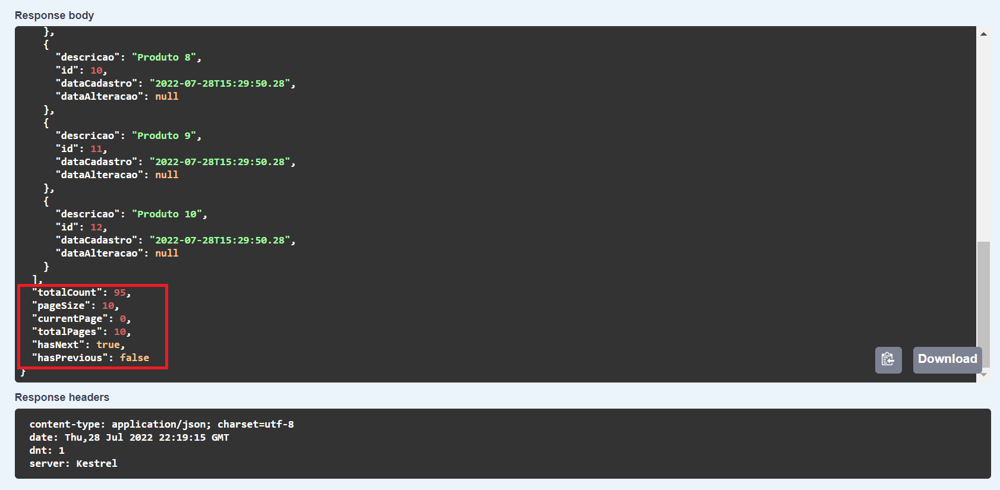
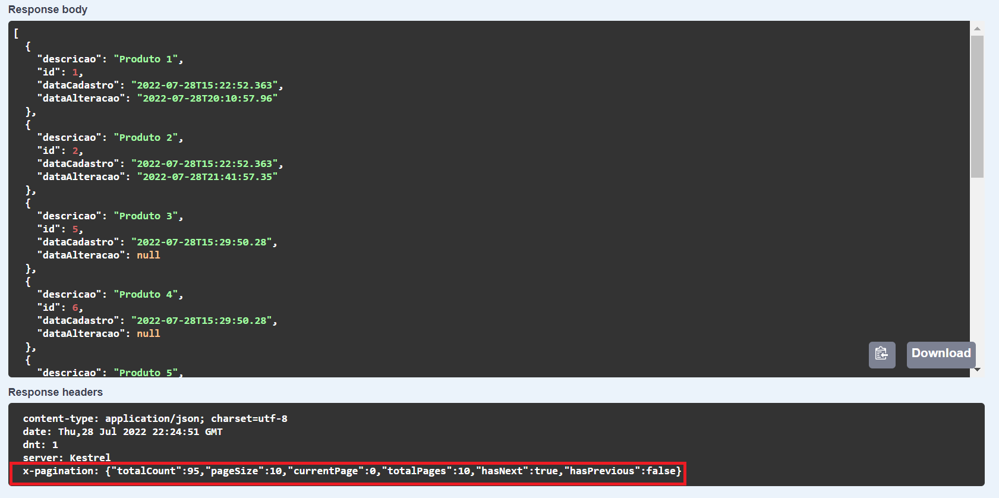

# .NET PAGINATION

## Back-End

- Net 6
- Dapper
- EF Core
- Swagger
- Pagination

#

### POC abordando conceito de paginação utilizando o header e o body para apresentar informações referente a paginação (total, pagesize, currentpage, totalpages, etc).

#

- Paginação retornando informações no body.

- Paginação retornando informações no header (x-pagination).

